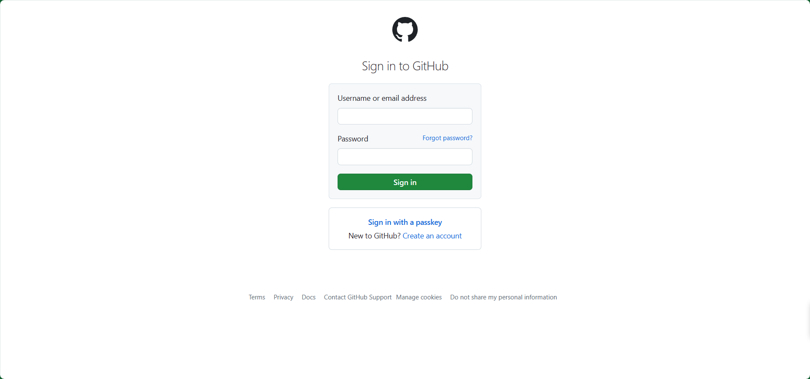
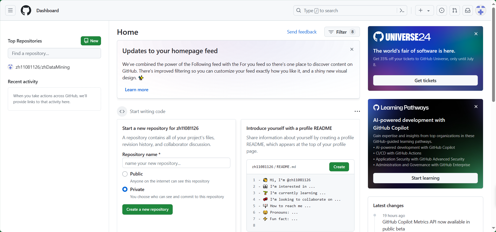
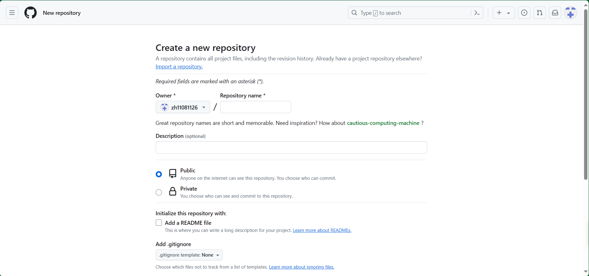
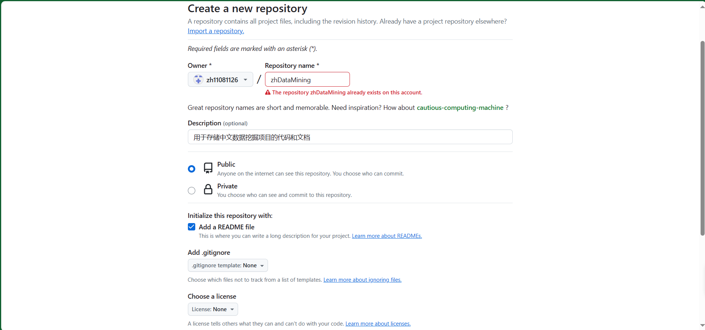
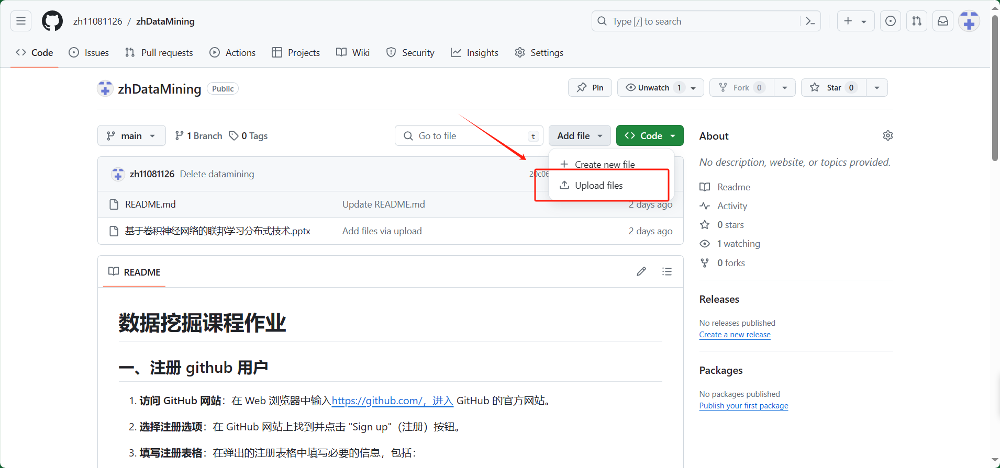
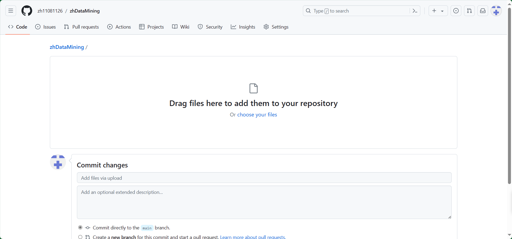
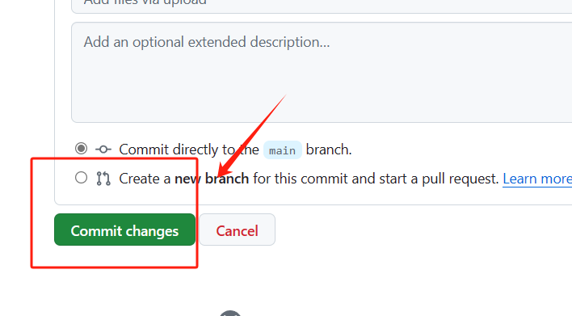

# 数据挖掘课程作业

## 一、注册 github 用户
 
1. **访问 GitHub 网站**：在 Web 浏览器中输入https://github.com/，进入 GitHub 的官方网站。

2. **选择注册选项**：在 GitHub 网站上找到并点击 "Sign up"（注册）按钮。

3. **填写注册表格**：在弹出的注册表格中填写必要的信息，包括：
   - 用户名（Username）：想要在 GitHub 上显示的用户名。
   - 电子邮件地址（Email address）：电子邮件地址。
   - 密码（Password）：GitHub 账户的密码。
   - 选择订阅（Choose a plan）：GitHub 提供了免费和付费的订阅选项，选择想要的类型。
   - 验证身份（Verify your humanity）：根据提示进行人机验证，可能是输入验证码或进行其他验证步骤。

4. **验证电子邮件地址**：注册后，GitHub 会向提供的电子邮件地址发送一封确认邮件。查看电子邮件收件箱，并按照邮件中的指示完成验证过程。

5. **设置个人资料**：一旦验证了电子邮件地址，可以登录到 GitHub 并设置个人资料，包括个人简介、头像等信息。

6. **探索 GitHub**：注册成功后，就可以开始使用 GitHub，探索各种开源项目、参与社区、创建自己的仓库等。

## 二、建立一个库zhDataMining

1. **登录GitHub**：首先，确保您已经注册并登录到 GitHub 帐户。

2. **导航到仓库页面**：登录后，点击右上角加号旁边的加号图标，然后选择 "New repository"（新建仓库）。

3. **填写仓库信息**：
   - **Repository name**（仓库名称）：输入 "zhDataMining"。
   - **Description**（描述）（可选）：输入一个简短的描述，例如："用于存储中文数据挖掘项目的代码和文档"。
   - **Public / Private**（公开/私有）：选择适合需求的选项。如果想要所有人都能够查看仓库，则选择 "Public"（公开）。
   - **Initialize this repository with**（初始化仓库）：如果想在仓库中添加一个 README 文件，选择 "Add a README file"（添加一个 README 文件）。
   - **Add .gitignore**（添加 .gitignore 文件）：根据项目需求选择合适的选项。
   - **Choose a license**（选择许可证）：根据项目需求选择合适的选项。
   
4. **点击 "Create repository"**：填写完毕后，点击页面下方的绿色按钮 "Create repository"。

## 三、上传PPT到zhDataMining中

1. **登录GitHub**：确保已经登录到 GitHub 帐户。

2. **导航到 "zhDataMining" 仓库页面**：在 GitHub 主页或仓库列表中找到并点击 "zhDataMining" 仓库，进入该仓库的页面。

3. **点击 "Add file" 按钮**：在仓库页面的右上角，点击 "Add file"，然后选择 "Upload files"。

4. **上传PPT文件**：
   - **拖拽上传**：可以直接将 PPT 文件拖拽到上传区域。
   - **点击上传**：或者点击上传区域选择文件，然后选择要上传的 PPT 文件。

5. **填写提交信息**：在页面下方的 "Commit changes" 区域，输入提交信息，描述上传的 PPT 文件。

6. **点击 "Commit changes" 按钮**：完成上述步骤后，点击 "Commit changes" 提交更改。

## 四、想学习或获得的计算机技能
目前无想要学习的计算机技能，只是在编写代码过程中出现了以下难点无法解决：针对利用MNIST数据集训练完成的联邦学习cnn神经网络，如何识别神经网络中的对要遗忘的类别最具辨别力的通道？
